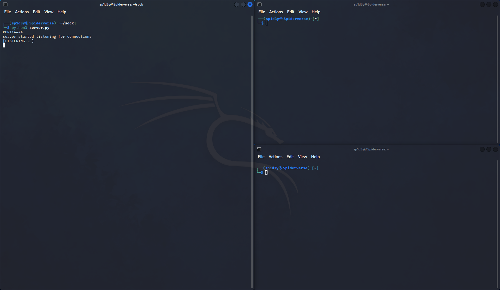
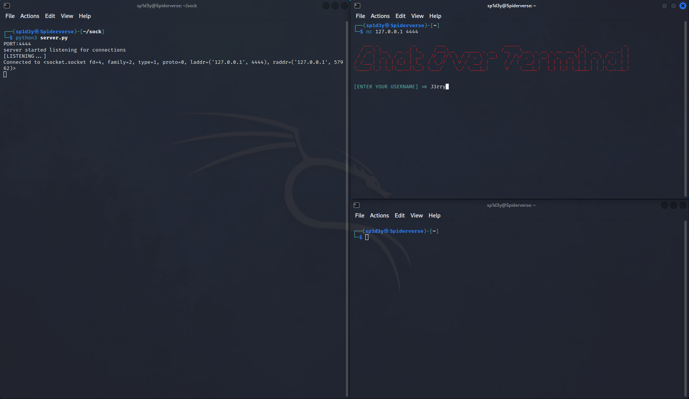
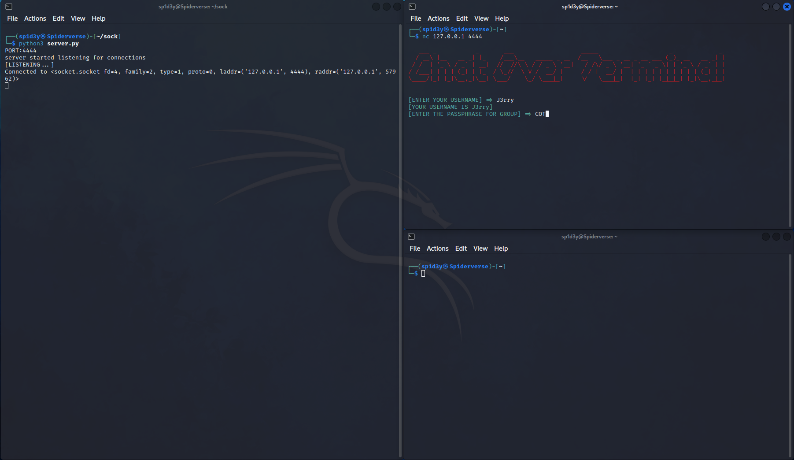
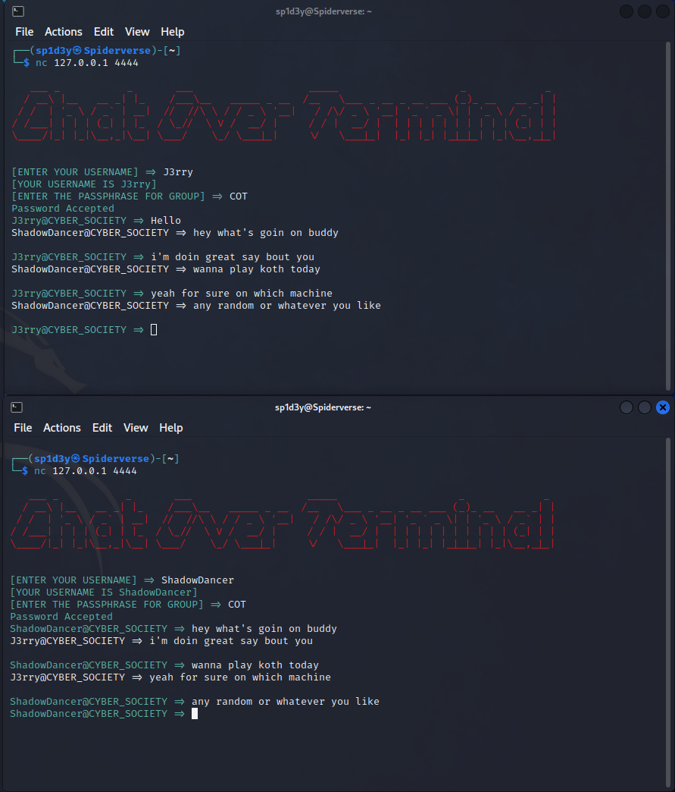

# ChatOverTerminal

## **About ChatOverTerminal ;-)**

### COT (Chat Over Terminal) is a Python script that allows you to quickly set up a chat server for communication over the terminal. With COT, you can easily create a chat environment where multiple users can exchange messages in real-time. It provides a simple and convenient way to establish a chat system without the need for complex setups or external tools. Whether you need to have a quick conversation or collaborate with others in a terminal-based environment, COT simplifies the process and facilitates seamless communication.

## Steps for using it ;-)

- **wget [https://github.com/jerrygems/ChatOverTerminal.git](https://github.com/jerrygems/ChatOverTerminal.git)**
- **Host it on the server**
- **Run the COT-server.py**
- **Use NETCAT to connect with it and same steps for your friends**

```jsx
nc <IP_ADDRESS> <PORT>
```

- **PORT will be 4444 if you’ve not changed it yet**
- **then you’ll be asked for passphrase that is COT by default (”passphrase can be changed for your convenience”)**
- **And then you’ll be connected**








